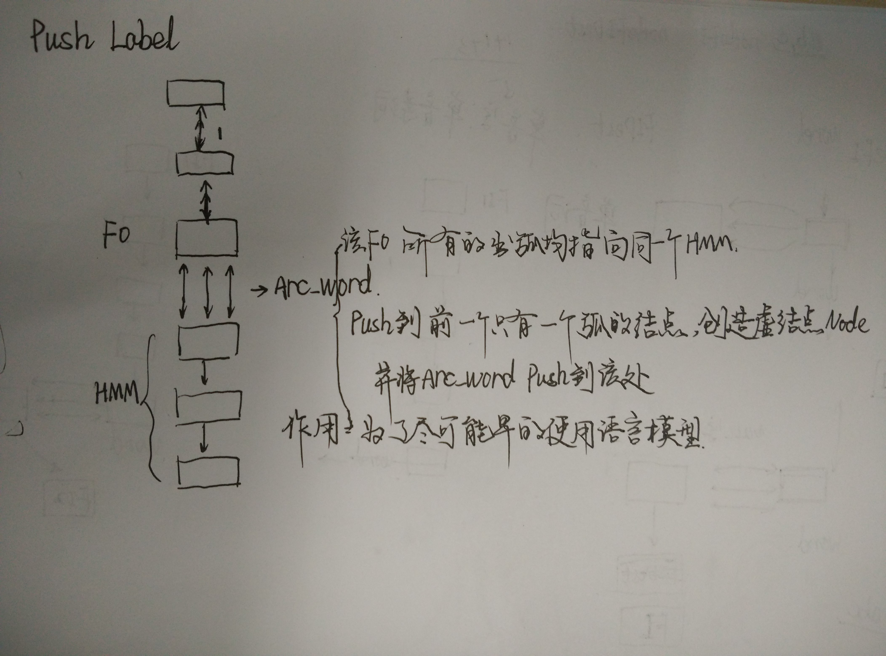
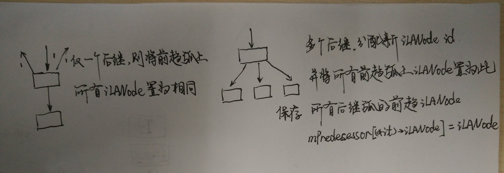

# Note on Bavieca

## TODO
* DONE 叶子节点
* DONE 单音素处理
* DONE MI-Node处理
* TODO LM lookahead
* TODO LM state
* TODO 词头尾可跳转的sil
* TODO 语言模型cache
* TODO garbage collection
* DONE push label作用
* TODO Disk-Based Language Models

## Key
* fan-in和fan-out均指向相同的FI node，保证了词尾x+c和词头c-有相同的context, 解决了进入下一个lexicon-tree时的context连续问题
* merge多次的原因: 下层节点的合并可能导致上层节点的再合并
* push label 将单出度的FO节点的Word_ARC向前push，目的尽可能早的应用语言模型
* 单因素Word Node节点作用,减少弧和节点数，通过该节点中继到其他fi节点

## 剪枝 cut-off parameter
* beam
```cpp
// pruning parameters
m_iMaxActiveNodes = iMaxActiveNodes; //最多激活的Lexicon tree节点数
m_iMaxActiveNodesWE = iMaxActiveNodesWE;
m_iMaxActiveTokensNode = iMaxActiveTokensNode; //每个节点最多激活的Token数
m_fBeamWidthNodes = fBeamWidthNodes; // Lexicon Tree 节点直方图Beam Width
m_fBeamWidthNodesWE = fBeamWidthNodesWE;
m_fBeamWidthTokensNode = fBeamWidthTokensNode; // 每个节点上的Token的直方图Beam Width

为每个node分配Token, iActiveTokensNextBase = -1时未分配
node->iActiveTokensNextBase == -1
node->iActiveTokensNextBase = newActiveTokenTable();

```

## PhoneSet
顺序读入phone列表，分配id
``` cpp
while(std::getline(file.getStream(),strLine)) {
    ++iLine;
    // read the phone
    std::stringstream s(strLine);
    string strPhone;
    IOBase::readString(s,strPhone);

    Phone *phone = new Phone;
    phone->bContext = true;
    if ((strPhone.c_str()[0] == '(') && (strPhone.c_str()[strPhone.length()-1] == ')')) {
        phone->bContext = false;
        strPhone = strPhone.substr(1,strPhone.length()-2);
    }
    // 
    m_phones.push_back(strPhone);
    // 哈希, m_mPhone
    m_mPhone.insert(map<string,int>::value_type(strPhone,(int)(m_phones.size()-1)));
    // Index
    phone->iIndex = (unsigned char)(m_phones.size()-1);
    phone->strPhone = strPhone;
    // vector<Phone*> VPhone(m_vPhone)
    m_vPhone.push_back(phone);
}
```

## LexiconManager
``` cpp
// lexical unit transcription
typedef struct {
    int iLexUnit;                            // lexical unit id (unique correspondence id <> lexical unit in str format)
    int iLexUnitPron;                        // lexical unit id (unique correspondence id <> lexical unit + pronunciation)
    int iIndex;                              // index of the lexical unit within the lexicon file
    vector<int> vPhones;                 // phonetic transciption
    unsigned char iPronunciation;        // pronunciation number
    unsigned char iType;                 // standard / filler / sentence delimiter
    float fProbability;                  // pronunciation probability (respect to alternative ones of the same lex unit)
    float fInsertionPenalty;         // penalty for inserting this lexical unit during decoding
} LexUnit;

//对应多音字
typedef struct {
    int iLexUnit;                                   // lexical unit unique identifier
    const char *strLexUnit;                     // lexical unit as an array of characters (a word, a syllable, etc.)
    VLexUnit vLexUnitPronunciations;            // alternative pronunciations of the lexical unit
} LexUnitX;

```

## HMMManager
HMM 决策树
``` cpp

```

## LMManager
加载arpa或fst格式的语言模型

## NetworkBuilderX
* WW within-word CW cross-word
* FI MI FO 
* bWordEnd 最后一个hmm
* 树的结构

* Push Label

* Build LM look-ahead


## DynamicDecoderX

## pruning
``` cpp 
// pruning (token based)
void DynamicDecoderX::pruning() {

	assert(m_fScoreBestWE <= m_fScoreBest);
	
	m_fScoreBestWE = m_fScoreBest; //	HACK
	
	// compute threshold for beam based pruning
	int iNumberBins = NUMBER_BINS_HISTOGRAM;
	int iSurvivorsRegular = 0;
	float fThresholdRegular = m_fScoreBest-m_fBeamWidthNodes;	
	
	// (1) apply within-node pruning
		
	// apply pruning to each arc
	m_iNodesActiveCurrent = 0;
	int iPrunedTotal = 0;	
	int *iBins = new int[iNumberBins];
	int iBin;
	float fScoreBestNode = -FLT_MAX;
	float *fThresholdNode = new float[m_iNodesActiveNext];
	int iSurvivorsAll = 0;
	// 计算每个节点的Token直方图剪枝阈值
	for(int i=0 ; i < m_iNodesActiveNext ; ++i) {
	
		DNode *node = m_nodesActiveNext[i];
		assert(node->iActiveTokensNext > 0);
		fThresholdNode[i] = fThresholdRegular;
		
		// (a) histogram pruning within the node
		if (node->iActiveTokensNext > m_iMaxActiveTokensNode) {
		
			// get the best score within the node
			fScoreBestNode = -FLT_MAX;
			for(int j=0 ; j < node->iActiveTokensNext ; ++j) {
				Token *token = m_tokensNext+(m_activeTokenNext+node->iActiveTokensNextBase)[j].iToken;
				if (token->fScore > fScoreBestNode) {
					fScoreBestNode = token->fScore;
				}
			}
		
			// compute bin-size for histogram pruning
			float fLength = m_fBeamWidthTokensNode+1;
			float fBinSize = fLength/((float)iNumberBins);
			assert(fBinSize > 0);
					
			fThresholdNode[i] = max(fScoreBestNode-m_fBeamWidthTokensNode,fThresholdRegular);
		
			// (2.1) compute the size of each bin and initialize them
			for(int j = 0 ; j < iNumberBins ; ++j) {
				iBins[j] = 0;
			}
			// (2.2) fill the bins, the first bin keeps the best tokens
			ActiveToken *activeTokensNext = m_activeTokenNext+node->iActiveTokensNextBase;
			for(int j=0 ; j < node->iActiveTokensNext ; ++j) {
				Token *token = m_tokensNext+activeTokensNext[j].iToken;
				if (token->fScore > fThresholdNode[i]) {
					iBin = (int)(fabs(token->fScore-fScoreBestNode)/fBinSize);
					assert((iBin >= 0) && (iBin < iNumberBins));
					iBins[iBin]++;
				}
			}
			// (2.3) get the threshold
			int iSurvivors = 0;
			float fThresholdHistogram = fThresholdRegular;
			for(int j = 0 ; j < iNumberBins-1 ; ++j) {
				iSurvivors += iBins[j];
				// this is the cut-off
				if (iSurvivors >= m_iMaxActiveTokensNode) {
					fThresholdHistogram = fScoreBestNode-((j+1)*fBinSize);
					iSurvivorsAll += iSurvivors;
					break;
				}
			}
			fThresholdNode[i] = max(fThresholdNode[i],fThresholdHistogram);
		} else {
			iSurvivorsAll += node->iActiveTokensNext;
		}
	}
	
	// (2) global-pruning
	// 计算全局的直方图剪枝阈值
	// histogram pruning?
	if (iSurvivorsAll > m_iMaxActiveNodes) {
	
		// (2.1) compute the size of each bin and initialize them
		float fLengthRegular = m_fBeamWidthNodes+1;
		float fBinSizeRegular = ((float)fLengthRegular)/((float)iNumberBins);
		assert(fBinSizeRegular > 0);
		int *iBinsRegular = new int[iNumberBins];
		int iRegular = 0;
		for(int i = 0 ; i < iNumberBins ; ++i) {
			iBinsRegular[i] = 0;
		}
		// (2.2) fill the bins, the first bin keeps the best tokens
		int iBin;
		
		for(int i=0 ; i < m_iNodesActiveNext ; ++i) {
			ActiveToken *activeTokens = m_activeTokenNext+m_nodesActiveNext[i]->iActiveTokensNextBase;
			for(int j=0 ; j < m_nodesActiveNext[i]->iActiveTokensNext ; ++j) {
				Token *token = m_tokensNext+activeTokens[j].iToken;
				if (token->fScore <= fThresholdNode[i]) {
					continue;
				}	
				iBin = (int)(fabs(token->fScore-m_fScoreBest)/fBinSizeRegular);
				assert((iBin >= 0) && (iBin < iNumberBins));
				iBinsRegular[iBin]++;
				++iRegular;
			}
		}	
		// (2.3) get the threshold
		float fThresholdHistogramRegular = fThresholdRegular;
		for(int i = 0 ; i < iNumberBins-1 ; ++i) {
			iSurvivorsRegular += iBinsRegular[i];
			// this is the cut-off
			if (iSurvivorsRegular >= m_iMaxActiveNodes) {
				fThresholdHistogramRegular = m_fScoreBest-((i+1)*fBinSizeRegular);
				break;
			}
		}
		fThresholdRegular = max(fThresholdRegular,fThresholdHistogramRegular);

		delete [] iBinsRegular;
	}	
		
	// (3) actual pruning
	// 剪枝
	for(int i=0 ; i < m_iNodesActiveNext ; ++i) {
	
		DNode *node = m_nodesActiveNext[i];
		// 剪枝阈值取全局和Node上剪枝阈值的最大值
		fThresholdNode[i] = max(fThresholdNode[i],fThresholdRegular);	
		
		int iPruned = 0;
		int iAvailable = -1;
		ActiveToken *activeTokensNext = m_activeTokenNext+node->iActiveTokensNextBase;
		for(int j=0 ; j < node->iActiveTokensNext ; ++j) {
			Token *token = m_tokensNext+activeTokensNext[j].iToken;
			if (token->fScore < fThresholdNode[i]) {
				if (iAvailable == -1) {
					iAvailable = j;	
				}
				++iPruned;
			} else if (iAvailable != -1) {
				activeTokensNext[iAvailable] = activeTokensNext[j];
				++iAvailable;
			}
		}
		iPrunedTotal += iPruned;
		assert(node->iActiveTokensCurrentBase == -1);
		assert(node->iActiveTokensCurrent == 0);
		int iSurvivors = node->iActiveTokensNext-iPruned;
		//iSurvivorsH[iSurvivors]++;
		if (iSurvivors > 0) {
			assert(node->iActiveTokensNextBase != -1);
			node->iActiveTokensCurrentBase = node->iActiveTokensNextBase;
			node->iActiveTokensCurrent = iSurvivors;
			m_nodesActiveCurrent[m_iNodesActiveCurrent++] = node;
		}
		node->iActiveTokensNextBase = -1;
		node->iActiveTokensNext = 0;
	}
	
	delete [] iBins;
	delete [] fThresholdNode;
	
	//printf("# tokens active: (%d -> %d)\n",m_iTokensNext,m_iTokensNext-iPrunedTotal);
	
	// clean the table of next active states
	m_iNodesActiveNext = 0;	
	
	// swap the token tables
	swapTokenTables();
}
```
