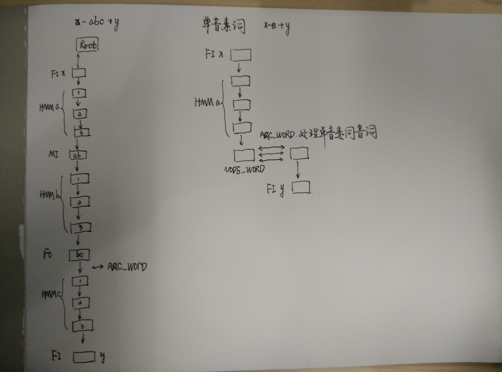

# Note on Bavieca

## TODO
* TODO 叶子节点
* TODO 单音素处理
* TODO MI-Node处理
* TODO LM lookahead
* TODO LM state
* TODO 语言模型cache

## 剪枝 cut-off parameter
* beam
```cpp
// pruning parameters
//iMaxActiveNode
int iMaxActiveArcs = configuration.getIntParameterValue("pruning.maxActiveArcs");
int iMaxActiveArcsWE = configuration.getIntParameterValue("pruning.maxActiveArcsWE");
//iMaxActiveTokenNode
int iMaxActiveTokensArc = configuration.getIntParameterValue("pruning.maxActiveTokensArc");
float fBeamWidthArcs = configuration.getFloatParameterValue("pruning.likelihoodBeam");
float fBeamWidthArcsWE = configuration.getFloatParameterValue("pruning.likelihoodBeamWE");
float fBeamWidthTokensArc = configuration.getFloatParameterValue("pruning.likelihoodBeamTokensArc");

```

## PhoneSet
顺序读入phone列表，分配id
``` cpp
while(std::getline(file.getStream(),strLine)) {
    ++iLine;
    // read the phone
    std::stringstream s(strLine);
    string strPhone;
    IOBase::readString(s,strPhone);

    Phone *phone = new Phone;
    phone->bContext = true;
    if ((strPhone.c_str()[0] == '(') && (strPhone.c_str()[strPhone.length()-1] == ')')) {
        phone->bContext = false;
        strPhone = strPhone.substr(1,strPhone.length()-2);
    }
    // 
    m_phones.push_back(strPhone);
    // 哈希, m_mPhone
    m_mPhone.insert(map<string,int>::value_type(strPhone,(int)(m_phones.size()-1)));
    // Index
    phone->iIndex = (unsigned char)(m_phones.size()-1);
    phone->strPhone = strPhone;
    // vector<Phone*> VPhone(m_vPhone)
    m_vPhone.push_back(phone);
}
```

## LexiconManager
``` cpp
// lexical unit transcription
typedef struct {
    int iLexUnit;                            // lexical unit id (unique correspondence id <> lexical unit in str format)
    int iLexUnitPron;                        // lexical unit id (unique correspondence id <> lexical unit + pronunciation)
    int iIndex;                              // index of the lexical unit within the lexicon file
    vector<int> vPhones;                 // phonetic transciption
    unsigned char iPronunciation;        // pronunciation number
    unsigned char iType;                 // standard / filler / sentence delimiter
    float fProbability;                  // pronunciation probability (respect to alternative ones of the same lex unit)
    float fInsertionPenalty;         // penalty for inserting this lexical unit during decoding
} LexUnit;

//对应多音字
typedef struct {
    int iLexUnit;                                   // lexical unit unique identifier
    const char *strLexUnit;                     // lexical unit as an array of characters (a word, a syllable, etc.)
    VLexUnit vLexUnitPronunciations;            // alternative pronunciations of the lexical unit
} LexUnitX;

```

## HMMManager
HMM 决策树
``` cpp

```

## LMManager
加载arpa或fst格式的语言模型

## NetworkBuilderX
* WW within-word CW cross-word
* FI MI FO 
* 树的结构


## DynamicDecoderX
* 
