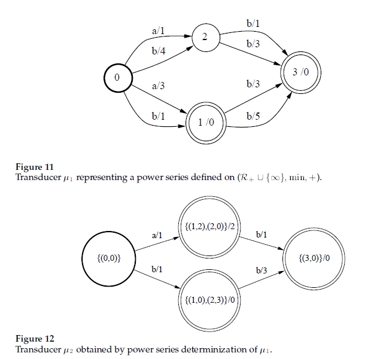
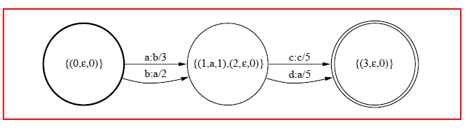

# Note on Fst


## Determine

### Determine Algorithm
* fst weight实现已解决,加两步后处理:
    1. 对每个label可达的子集，状态去重, 求最小权重
    2. 对所有状态weight取最小，即为该label（弧）上的权重

* fst output determine
    1. residual output, 同weight residual weight
    2. 因此有的弧上是label的数组，这样输出新的fst时,根据该弧上的label数增加状态

### Determine Kaldi Code
* fst kaldi ProcessTransition
```cpp
  void ProcessTransition(OutputStateId state, Label ilabel, vector<Element> *subset) {
    // At input, "subset" may contain duplicates for a given dest state (but in sorted
    // order).  This function removes duplicates from "subset", normalizes it, and adds
    // a transition to the dest. state (possibly affecting Q_ and hash_, if state did not
    // exist).
    // 每个label可达的状态去重, 仅保留权重最小的
    typedef typename vector<Element>::iterator IterType;
    {  // This block makes the subset have one unique Element per state, adding the weights.
      IterType cur_in = subset->begin(), cur_out = cur_in, end = subset->end();
      size_t num_out = 0;
      // Merge elements with same state-id
      while (cur_in != end) {  // while we have more elements to process.
        // At this point, cur_out points to location of next place we want to put an element,
        // cur_in points to location of next element we want to process.
        if (cur_in != cur_out) *cur_out = *cur_in;
        cur_in++;
        while (cur_in != end && cur_in->state == cur_out->state) {  // merge elements.
          if (cur_in->string != cur_out->string) {
            std::cerr << "DeterminizerStar: FST was not functional -> not determinizable\n";
            throw std::runtime_error("Non-functional FST: cannot determinize.\n");
          }            
          cur_out->weight = Plus(cur_out->weight, cur_in->weight);
          cur_in++;
        }
        cur_out++;
        num_out++;
      }
      subset->resize(num_out);
    }

    // 求该label弧上的权重,即所有可达状态的最小权重
    // 求该label弧上的输出串,即所有可达状态的最小串
    StringId common_str;
    Weight tot_weight;
    {  // This block computes common_str and tot_weight (essentially: the common divisor)
      // and removes them from the elements.
      vector<Label> seq;

      IterType begin = subset->begin(), iter, end = subset->end();
      {  // This block computes "seq", which is the common prefix, and "common_str",
        // which is the StringId version of "seq".
        vector<Label> tmp_seq;
        for (iter = begin; iter!= end; ++iter) {
          if (iter == begin) {
            repository_.SeqOfId(iter->string, &seq);
          } else {
            repository_.SeqOfId(iter->string, &tmp_seq);
            if (tmp_seq.size() < seq.size()) seq.resize(tmp_seq.size());  // size of shortest one.
            for (size_t i = 0;i < seq.size(); i++) // seq.size() is the shorter one at this point.
              if (tmp_seq[i] != seq[i]) seq.resize(i);
          }
          if (seq.size() == 0) break;  // will not get any prefix.
        }
        common_str = repository_.IdOfSeq(seq);
      }

      {  // This block computes "tot_weight".
        iter = begin;
        tot_weight = iter->weight;
        for (++iter; iter!= end; ++iter)
          tot_weight = Plus(tot_weight, iter->weight);
      }

      // Now divide out common stuff from elements.
      size_t prefix_len = seq.size();
      for (iter = begin; iter != end; ++iter) {
        iter->weight = Divide(iter->weight, tot_weight);
        iter->string = repository_.RemovePrefix(iter->string, prefix_len);
      }
    }

    // Now add an arc to the state that the subset represents.
    // We may create a new state id for this (in SubsetToStateId).
    TempArc temp_arc;
    temp_arc.ilabel = ilabel;
    temp_arc.nextstate = SubsetToStateId(*subset);  // may or may not really add the subset.
    temp_arc.ostring = common_str;
    temp_arc.weight = tot_weight;
    output_arcs_[state].push_back(temp_arc);  // record the arc.
  }
```
* fst kaldi ProcessTransition

```cpp

  void  Output(MutableFst<Arc> *ofst, bool destroy = true) {
    assert(determinized_);
    if (destroy) determinized_ = false;
    // Outputs to standard fst.
    OutputStateId nStates = static_cast<OutputStateId>(output_arcs_.size());
    if (destroy)
      FreeMostMemory();
    ofst->DeleteStates();
    if (nStates == 0) {
      ofst->SetStart(kNoStateId);
      return;
    }
    // Add basic states-- but will add extra ones to account for strings on output.
    for (OutputStateId s = 0;s < nStates;s++) {
      OutputStateId news = ofst->AddState();
      assert(news == s);
    }
    ofst->SetStart(0);
    for (OutputStateId this_state = 0; this_state < nStates; this_state++) {
      vector<TempArc> &this_vec(output_arcs_[this_state]);

      typename vector<TempArc>::const_iterator iter = this_vec.begin(), end = this_vec.end();
      for (;iter != end; ++iter) {
        const TempArc &temp_arc(*iter);
        vector<Label> seq;
        repository_.SeqOfId(temp_arc.ostring, &seq);

        if (temp_arc.nextstate == kNoStateId) {  // Really a final weight.
          // Make a sequence of states going to a final state, with the strings as labels.
          // Put the weight on the first arc.
          OutputStateId cur_state = this_state;
          for (size_t i = 0;i < seq.size();i++) {
            OutputStateId next_state = ofst->AddState();
            Arc arc;
            arc.nextstate = next_state;
            arc.weight = (i == 0 ? temp_arc.weight : Weight::One());
            arc.ilabel = 0;  // epsilon.
            arc.olabel = seq[i];
            ofst->AddArc(cur_state, arc);
            cur_state = next_state;
          }
          ofst->SetFinal(cur_state, (seq.size() == 0 ? temp_arc.weight : Weight::One()));
        } else {  // Really an arc.
          OutputStateId cur_state = this_state;
          // Have to be careful with this integer comparison (i+1 < seq.size()) because unsigned.
          // i < seq.size()-1 could fail for zero-length sequences.
          //对于该弧上输出串大于1的，创建状态串连接
          for (size_t i = 0; i+1 < seq.size();i++) {
            // for all but the last element of seq, create new state.
            OutputStateId next_state = ofst->AddState();
            Arc arc;
            arc.nextstate = next_state;
            arc.weight = (i == 0 ? temp_arc.weight : Weight::One());
            arc.ilabel = (i == 0 ? temp_arc.ilabel : 0);  // put ilabel on first element of seq.
            arc.olabel = seq[i];
            ofst->AddArc(cur_state, arc);
            cur_state = next_state;
          }
          // Add the final arc in the sequence.
          Arc arc;
          arc.nextstate = temp_arc.nextstate;
          arc.weight = (seq.size() <= 1 ? temp_arc.weight : Weight::One());
          arc.ilabel = (seq.size() <= 1 ? temp_arc.ilabel : 0);
          arc.olabel = (seq.size() > 0 ? seq.back() : 0);
          ofst->AddArc(cur_state, arc);
        }
      }
      // Free up memory.  Do this inside the loop as ofst is also allocating memory
      if (destroy) { vector<TempArc> temp; temp.swap(this_vec); }
    }
    if (destroy) {
      vector<vector<TempArc> > temp;
      temp.swap(output_arcs_);
      repository_.Destroy();
    }
  }
```

### Determine Demo





